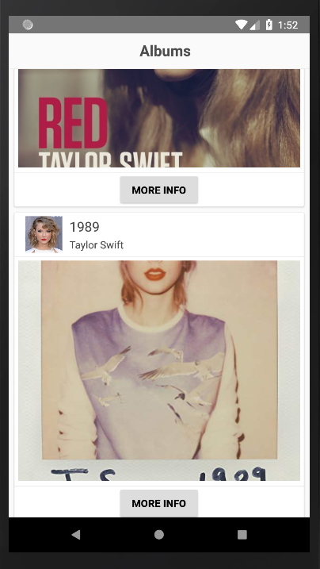

### Hi!

### This is a React Native training little app.
What it does is get a list of music albums from the internet and display them in a list with a button to go to the Amazon related page.

---

##### Screenshots:
Beggining of the list

List scrolled

